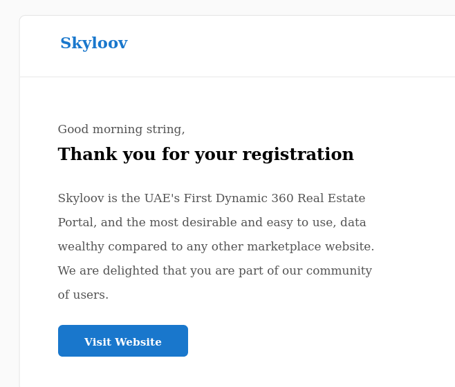

# Overview


 
 


## Skyloov :  
### Code challenge for Skyloov Property Portal, This is some of useful links for reviewing and testing the project : 

- [Swagger documentation](http://localhost:8000/swagger/)  
- [redocs documentation](http://localhost:8000/redocs/) 
## Requirements

- [Docker file](https://github.com/yassine-youcefi/Skyloov/blob/main/Dockerfile)

  > Contain docker global config ...

- [Docker-compose](https://github.com/yassine-youcefi/Skyloov/blob/main/docker-compose.yml)

  > My docker containers configuration ...

- [requirements.txt](https://github.com/yassine-youcefi/Skyloov/blob/main/requirements.txt)

  > All python requirements ...

- `.env`

  > Project environment variables

<br>
<hr>
<br>

## Start-up

> Pleas follow the steps below.

1. clone repo then open terminal

   - `docker-compose build`
   - `docker-compose up`
     > Now our API server start ...
   - `docker exec -it skyloov bash`

     > To accesses skyloov app container bash

   - `python3 -c 'import secrets; print(secrets.token_urlsafe(38))'`
     > Generate a SecretKey
     > Please turn the DEBUG to False (if u wanna try the prod mode) in settings.py

2. After lunching the skyloov app container and got into it:

   - `python manage.py migrate`
   - `python manage.py createsuperuser`

   - > Enter the username and password for the admin pannel

3. If you want to run the tests:

   - `python manage.py pytest`


<br>
<hr>
<br>

## Connect Application :

### End-point : connect token

- For obtaining a token we should send a POST request to API. Request body must have two parts : username and password.

#### Method: POST

<http://localhost:8000/connect/token/>

#### Headers

| Content-Type | Value            |
| ------------ | ---------------- |
| Content-Type | application/json |

#### Body (**raw**)

```json
{
  "username": "***",
  "password": "***"
}
```

#### Response (**raw**) 200

```json
{
  "refresh": "eyJhbGciOiJIUzI1NiIsInR5cCI6IkpXVCJ9...",
  "access": "eyJhbGciOiJIUzI1NiIsInR5cCI6IkpXVCJ9..."
}
```

⁃ ⁃ ⁃ ⁃ ⁃ ⁃ ⁃ ⁃ ⁃ ⁃ ⁃ ⁃ ⁃ ⁃ ⁃ ⁃ ⁃ ⁃ ⁃ ⁃ ⁃ ⁃ ⁃ ⁃ ⁃ ⁃ ⁃ ⁃ ⁃ ⁃ ⁃ ⁃ ⁃ ⁃ ⁃ ⁃ ⁃ ⁃ ⁃ ⁃ ⁃ ⁃ ⁃ ⁃ ⁃ ⁃ ⁃

### End-point : connect verify token

- For verify a token we should send a POST request to API. Request body must have two parts : token.

#### Method: POST

<http://localhost:8000/connect/api/token/verify/>

#### Headers

| Content-Type | Value            |
| ------------ | ---------------- |
| Content-Type | application/json |

#### Body (**raw**)

```json
{
    "token":"eyJhbGciOiJIUzI1NiIsInR5cCI6IkpXVCJ9."
}
```

#### Response (**raw**) 200
``

⁃ ⁃ ⁃ ⁃ ⁃ ⁃ ⁃ ⁃ ⁃ ⁃ ⁃ ⁃ ⁃ ⁃ ⁃ ⁃ ⁃ ⁃ ⁃ ⁃ ⁃ ⁃ ⁃ ⁃ ⁃ ⁃ ⁃ ⁃ ⁃ ⁃ ⁃ ⁃ ⁃ ⁃ ⁃ ⁃ ⁃ ⁃ ⁃ ⁃ ⁃ ⁃ ⁃ ⁃ ⁃ ⁃ ⁃

### End-point: connect token refresh

- To refresh the JWT token, you can send a POST request to the token refresh endpoint with the refresh token in the request body.

#### Method: GET

<http://localhost:8000/connect/token/refresh/>

#### Body (**raw**)

```json
{
  "refresh": "eyJhbGciOiJIUzI1NiIsInR5cCI6IkpXVCJ9..."
}
```

#### Response (**raw**) 200

```json
{
  "access": "eyJhbGciOiJIUzI1NiIsInR5cCI6IkpXVCJ9...",
  "refresh": "eyJhbGciOiJIUzI1NiIsInR5cCI6IkpXVCJ9..."
}
```

<br>
<hr>
<br>

## Products Application :

### End-point: products search

#### Method: GET

<http://localhost:8000/products/search/>

#### 🔑 Authentication bearer

| Param | value        | Type   |
| ----- | ------------ | ------ |
| token | <tour_token> | string |

> NOTE: This view return paginated response, 20 products per page.

#### Response (**raw**)

- The response will look like this for example:

```json
{
  "count": 1,
  "next": null,
  "previous": null,
  "results": [
    {
      "id": 1,
      "name": "test",
      "brand": "test",
      "description": "test",
      "category": "test",
      "price": "0.00",
      "quantity": 1,
      "image": null,
      "rating": 5.0,
      "created_at": "2023-05-06",
      "updated_at": "2023-05-06"
    }
  ]
}
```

- Here are some sample GET requests for each field :

  - name :
    
    <http://localhost:8000/products/search/?name=test>

  - brand :
    
    <http://localhost:8000/products/search/?brand=test>

  - category :
    
    <http://localhost:8000/products/search/?category=test>

  - price :
    
    <http://localhost:8000/products/search/?min_price=0&max_price=100>

  - quantity :
    
    <http://localhost:8000/products/search/?min_quantity=0&max_quantity=10>

  - rating :
    
    <http://localhost:8000/products/search/?rating=5>

  - created_at :
    
    <http://localhost:8000/products/search/?created_at=2023-05-05>

- You can also sort the results : 
    <http://localhost:8000/products/search/?sort=name>


